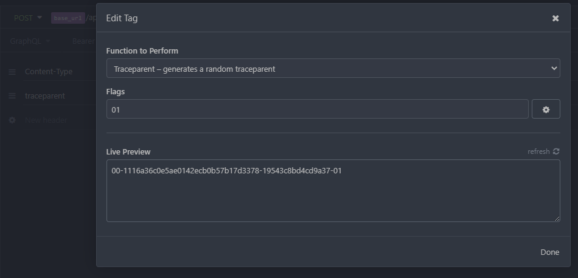
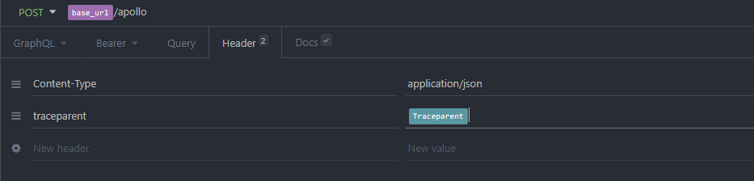

# Insomnia plugin - Traceparent tag

A template tag, that can be used to generate a random traceparent header.  

## Usage

1. Add the plugin to Insomnia by its name: "insomnia-plugin-traceparent-tag".  

1. Add tag traceparent on header request value
